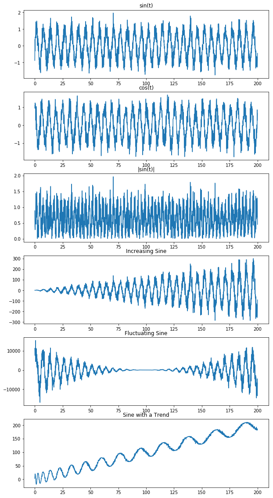
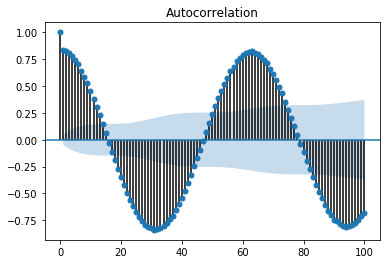
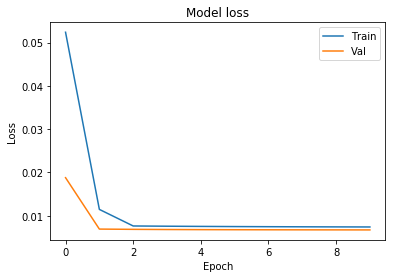
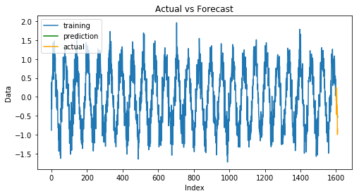
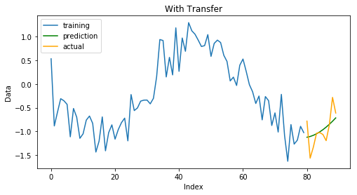
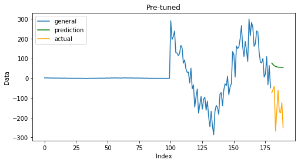
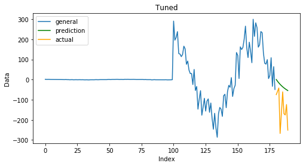
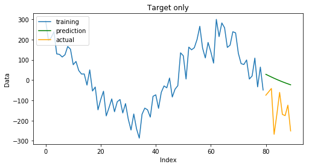

# Transfer Learning on Time Series Prediction

To find out more about the project, you can click **[here](https://medium.com/@nshanpotikyan/transfer-learning-for-time-series-prediction-4697f061f000)**. Here is an example how to get things going with the script.


```python
%run -i Preprocessing.py
%run -i Models.py
%run -i Visualizing.py
```

    Using TensorFlow backend.
    


```python
N = 2000 
T = N / 10
t = np.linspace(0,T,N)
stdv = 0.3
sin_series = np.sin(t) + np.random.normal(0,stdv,N)
cos_series = np.cos(t) + np.random.normal(0,stdv,N)
abs_series = abs(sin_series)
incr_sin = t * sin_series
flunc_sin = (t-100) + (t-100) ** 2 * (np.sin((t-100)) + np.random.normal(0,stdv,N))
sin_trend = 20 * (np.sin( np.pi * (np.sqrt(4 * t + 1) - 1) + 0.5 * np.random.normal(0,stdv,N))) + t 
```


```python
series_dict = {'t':t,
              'sin(t)':sin_series,
              'cos(t)':cos_series,
              '|sin(t)|':abs_series,
              'Increasing Sine':incr_sin,
              'Fluctuating Sine':flunc_sin,
              'Sine with a Trend':sin_trend}
```


```python
plotSeries(series_dict)
```





```python
ACF(sin_series,lags=100)
```





```python
# to perform a grid search over the parameter
# params_grid = {'input_size': [3,30,70],
#               'hidden_units':[100,[100,50],[100,50,50]],
#               'dropout': [True, False],
#               'learning_rate':[4e-5],
#               'n_ahead':[10],
#               'val_split': [0.2],
#               'epochs':[10],
#               'verbose':[False],
#               'plot':[False]}

# model, logs = GridSearch(sin_series,params_grid)
```

### Training a model on the source domain

Here we fit a model to the first series using the following hyperparameters and evaluate the model.


```python
params = {'input_size': 70,
          'hidden_units':[100,50],
          'dropout': False,
          'learning_rate':4e-5,
          'n_ahead':10,
          'val_split': 0.2,
          'epochs':10,
          'verbose': True,
          'plot': True}
```


```python
model, mse, hist = FitEvaluate(sin_series,params)
```

    WARNING:tensorflow:From C:\Users\Nshan\Anaconda3\lib\site-packages\tensorflow\python\framework\op_def_library.py:263: colocate_with (from tensorflow.python.framework.ops) is deprecated and will be removed in a future version.
    Instructions for updating:
    Colocations handled automatically by placer.
    WARNING:tensorflow:From C:\Users\Nshan\Anaconda3\lib\site-packages\tensorflow\python\ops\math_ops.py:3066: to_int32 (from tensorflow.python.ops.math_ops) is deprecated and will be removed in a future version.
    Instructions for updating:
    Use tf.cast instead.
    Train on 1224 samples, validate on 306 samples
    Epoch 1/10
    1224/1224 [==============================] - 72s 59ms/step - loss: 0.0524 - val_loss: 0.0188
    Epoch 2/10
    1224/1224 [==============================] - 69s 57ms/step - loss: 0.0115 - val_loss: 0.0069
    Epoch 3/10
    1224/1224 [==============================] - 73s 60ms/step - loss: 0.0076 - val_loss: 0.0069
    Epoch 4/10
    1224/1224 [==============================] - 70s 57ms/step - loss: 0.0076 - val_loss: 0.0068
    Epoch 5/10
    1224/1224 [==============================] - 68s 55ms/step - loss: 0.0075 - val_loss: 0.0068
    Epoch 6/10
    1224/1224 [==============================] - 69s 56ms/step - loss: 0.0075 - val_loss: 0.0068
    Epoch 7/10
    1224/1224 [==============================] - 70s 57ms/step - loss: 0.0075 - val_loss: 0.0068
    Epoch 8/10
    1224/1224 [==============================] - 68s 56ms/step - loss: 0.0075 - val_loss: 0.0068
    Epoch 9/10
    1224/1224 [==============================] - 68s 56ms/step - loss: 0.0074 - val_loss: 0.0067
    Epoch 10/10
    1224/1224 [==============================] - 69s 56ms/step - loss: 0.0074 - val_loss: 0.0067
    
    
    ======== Prediction Evaluation =========
    MSE is 0.0881
    








###  Transfer Learning Experiment

Now let's fit a similar model on the cosine series assuming that there is lack of data (only $100$ values instead of $2000$)


```python
TransferLearning(cos_series[-100:],params,model=model)
```

    *** Fitting a model without knowledge transfer ***
    Epoch 1/10
    10/10 [==============================] - 3s 276ms/step - loss: 0.0558
    Epoch 2/10
    10/10 [==============================] - 1s 69ms/step - loss: 0.0488
    Epoch 3/10
    10/10 [==============================] - 1s 59ms/step - loss: 0.0423
    Epoch 4/10
    10/10 [==============================] - 1s 66ms/step - loss: 0.0365
    Epoch 5/10
    10/10 [==============================] - 1s 70ms/step - loss: 0.0312
    Epoch 6/10
    10/10 [==============================] - 1s 71ms/step - loss: 0.0267
    Epoch 7/10
    10/10 [==============================] - 1s 55ms/step - loss: 0.0227
    Epoch 8/10
    10/10 [==============================] - 1s 54ms/step - loss: 0.0196
    Epoch 9/10
    10/10 [==============================] - 1s 58ms/step - loss: 0.0172
    Epoch 10/10
    10/10 [==============================] - 1s 53ms/step - loss: 0.0156
    
    
    *** Fitting a model with knowledge transfer ***
    Epoch 1/10
    10/10 [==============================] - 3s 262ms/step - loss: 0.0136
    Epoch 2/10
    10/10 [==============================] - 1s 55ms/step - loss: 0.0133
    Epoch 3/10
    10/10 [==============================] - 1s 53ms/step - loss: 0.0132
    Epoch 4/10
    10/10 [==============================] - 1s 52ms/step - loss: 0.0132
    Epoch 5/10
    10/10 [==============================] - 1s 55ms/step - loss: 0.0132
    Epoch 6/10
    10/10 [==============================] - 1s 53ms/step - loss: 0.0132
    Epoch 7/10
    10/10 [==============================] - 1s 54ms/step - loss: 0.0132
    Epoch 8/10
    10/10 [==============================] - 1s 54ms/step - loss: 0.0132
    Epoch 9/10
    10/10 [==============================] - 1s 54ms/step - loss: 0.0132
    Epoch 10/10
    10/10 [==============================] - 1s 53ms/step - loss: 0.0132
    
    
    ======== Results for no knowledge transfer =========
    The RMSE is 0.4769
    
    
    ======== Results for knowledge transfer =========
    The RMSE is 0.2727
    





```python
# to fit on the whole dataset with 50 ahead predictions
# params['n_ahead'] = 50
# TransferLearning(cos_series,params,model=model)
```

# General Domain Tuning


```python
generalTuning(sin_series[-100:],incr_sin[-100:],params)
```

    *** Fitting a model on general domain ***
    Epoch 1/10
    110/110 [==============================] - 8s 75ms/step - loss: 0.1937
    Epoch 2/10
    110/110 [==============================] - 6s 53ms/step - loss: 0.0503
    Epoch 3/10
    110/110 [==============================] - 6s 53ms/step - loss: 0.0433
    Epoch 4/10
    110/110 [==============================] - 6s 53ms/step - loss: 0.0404
    Epoch 5/10
    110/110 [==============================] - 6s 52ms/step - loss: 0.0381
    Epoch 6/10
    110/110 [==============================] - 6s 53ms/step - loss: 0.0362
    Epoch 7/10
    110/110 [==============================] - 6s 53ms/step - loss: 0.0346
    Epoch 8/10
    110/110 [==============================] - 6s 53ms/step - loss: 0.0331
    Epoch 9/10
    110/110 [==============================] - 6s 53ms/step - loss: 0.0317
    Epoch 10/10
    110/110 [==============================] - 6s 54ms/step - loss: 0.0304
    
     *** Tuning a model on target domain ***
    Epoch 1/10
    10/10 [==============================] - 3s 336ms/step - loss: 0.0186
    Epoch 2/10
    10/10 [==============================] - 1s 52ms/step - loss: 0.0084
    Epoch 3/10
    10/10 [==============================] - 1s 52ms/step - loss: 0.0062
    Epoch 4/10
    10/10 [==============================] - 1s 51ms/step - loss: 0.0064
    Epoch 5/10
    10/10 [==============================] - 1s 52ms/step - loss: 0.0066
    Epoch 6/10
    10/10 [==============================] - 1s 53ms/step - loss: 0.0066
    Epoch 7/10
    10/10 [==============================] - 1s 57ms/step - loss: 0.0066
    Epoch 8/10
    10/10 [==============================] - 1s 51ms/step - loss: 0.0065
    Epoch 9/10
    10/10 [==============================] - 1s 51ms/step - loss: 0.0065
    Epoch 10/10
    10/10 [==============================] - 1s 53ms/step - loss: 0.0065
    
     *** Fitting a model on target domain only ***
    Epoch 1/20
    10/10 [==============================] - 3s 346ms/step - loss: 0.3173
    Epoch 2/20
    10/10 [==============================] - 1s 51ms/step - loss: 0.2739
    Epoch 3/20
    10/10 [==============================] - 1s 52ms/step - loss: 0.2333
    Epoch 4/20
    10/10 [==============================] - 1s 51ms/step - loss: 0.1951
    Epoch 5/20
    10/10 [==============================] - 1s 57ms/step - loss: 0.1589
    Epoch 6/20
    10/10 [==============================] - 1s 58ms/step - loss: 0.1246
    Epoch 7/20
    10/10 [==============================] - 1s 52ms/step - loss: 0.0928
    Epoch 8/20
    10/10 [==============================] - 1s 59ms/step - loss: 0.0645
    Epoch 9/20
    10/10 [==============================] - 1s 51ms/step - loss: 0.0413
    Epoch 10/20
    10/10 [==============================] - 1s 52ms/step - loss: 0.0246
    Epoch 11/20
    10/10 [==============================] - 1s 52ms/step - loss: 0.0150
    Epoch 12/20
    10/10 [==============================] - 1s 51ms/step - loss: 0.0110
    Epoch 13/20
    10/10 [==============================] - 1s 52ms/step - loss: 0.0098
    Epoch 14/20
    10/10 [==============================] - 1s 55ms/step - loss: 0.0094
    Epoch 15/20
    10/10 [==============================] - 1s 58ms/step - loss: 0.0092
    Epoch 16/20
    10/10 [==============================] - 1s 56ms/step - loss: 0.0091
    Epoch 17/20
    10/10 [==============================] - 1s 56ms/step - loss: 0.0091
    Epoch 18/20
    10/10 [==============================] - 1s 63ms/step - loss: 0.0092
    Epoch 19/20
    10/10 [==============================] - 1s 61ms/step - loss: 0.0092
    Epoch 20/20
    10/10 [==============================] - 1s 53ms/step - loss: 0.0092
    
    
    ======== Results for pre_tuned model =========
    The RMSE is 212.3081
    
    
    ======== Results for tuned model =========
    The RMSE is 128.7268
    
    
    ======== Results for target model only =========
    The RMSE is 156.496
    










